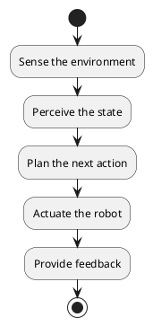

# Chapter 1: Introduction to Robotics and Automation

## 1.1 A Brief History of Robotics

The concept of automated machines has fascinated humanity for centuries, but the modern field of robotics began to take shape in the 20th century. The term "robot" was first introduced by Czech writer Karel Čapek in his 1920 play "R.U.R." (Rossum's Universal Robots), which depicted a future where artificial, human-like beings served as a labor force.

The first industrial robot, the Unimate, was developed by George Devol and Joseph Engelberger in the 1950s. This programmable arm was designed to perform repetitive and dangerous tasks in factories, marking the beginning of the industrial automation revolution.

The following decades saw rapid advancements in robotics, driven by developments in computer science, electronics, and materials science. The 1970s and 1980s brought the rise of microprocessors, which enabled more sophisticated control systems and the development of robots with enhanced sensory capabilities.

## 1.2 Core Concepts of Automation

Automation is the use of technology to perform tasks with minimal human intervention. In the context of robotics, automation involves programming robots to execute a series of actions to achieve a specific goal.

**Key concepts in automation include:**

- **Sensing**: Robots use sensors (e.g., cameras, lidar, force-torque sensors) to perceive their environment and gather data about their own state.
- **Perception**: The process of interpreting sensor data to build a meaningful understanding of the environment.
- **Planning**: Based on the perceived state of the environment and a given goal, the robot's control system plans a sequence of actions.
- **Actuation**: The robot's actuators (e.g., motors, grippers) execute the planned actions, causing the robot to move and interact with its environment.
- **Feedback**: The results of the robot's actions are monitored through sensors, and this feedback is used to adjust the plan and correct for errors.

**(Flow Diagram: The Automation Loop)**

## 1.3 Types of Robots

Robots come in a wide variety of shapes and sizes, each designed for specific applications. Some of the most common types of robots include:

- **Industrial Robots**: These are the most common type of robot, typically used in manufacturing for tasks such as welding, painting, assembly, and material handling. They are usually stationary and consist of a robotic arm with multiple joints.
- **Mobile Robots**: These robots are capable of moving around their environment. They can be wheeled, tracked, or legged. Examples include autonomous mobile robots (AMRs) used in warehouses and delivery drones.
- **Humanoid Robots**: These robots are designed to resemble the human body in shape and movement. They are often developed for research purposes, with the long-term goal of creating robots that can operate in human-centric environments and interact with people in a natural way.
- **Cobots (Collaborative Robots)**: These robots are designed to work safely alongside humans in a shared workspace. They are typically smaller, slower, and equipped with advanced safety features.

## 1.4 The Role of AI in Modern Robotics

Artificial intelligence (AI) is transforming the field of robotics, enabling robots to perform more complex and intelligent tasks. The integration of AI with robotics has led to the development of "intelligent robots" that can learn, adapt, and make decisions in real-time.

**Key areas where AI is impacting robotics include:**

- **Perception**: AI-powered computer vision allows robots to recognize objects, navigate complex environments, and understand human gestures.
- **Grasping and Manipulation**: AI algorithms enable robots to grasp and manipulate a wide variety of objects, even those they have never seen before.
- **Motion Planning**: AI techniques, such as reinforcement learning, are used to generate complex and efficient motion plans for robots, especially for tasks involving locomotion and navigation.
- **Human-Robot Interaction**: Natural Language Processing (NLP) and speech recognition allow humans to interact with robots using natural language, making them more user-friendly and accessible.
- **Decision Making**: AI gives robots the ability to make autonomous decisions based on their perception of the environment and their assigned goals.

The combination of robotics and AI is a powerful one, with the potential to revolutionize industries from manufacturing and logistics to healthcare and entertainment. This book will explore the technical foundations of this synergy, focusing on the mechanical aspects of robotics and the design of the AI-robot interface.
