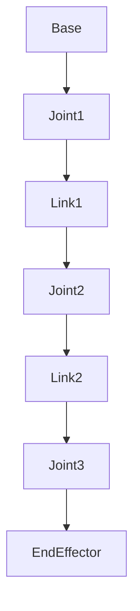

# Chapter 2: Mechanical Aspects of Robotics

## 2.1 Robot Anatomy: Links, Joints, and End-Effectors

At its core, a robot's mechanical structure is a carefully engineered assembly of rigid bodies (links) connected by movable elements (joints). This interconnected system forms a kinematic chain, enabling the robot to perform movements and interact with its environment.

-   **Links**: These are the rigid components of a robot's structure, analogous to the bones in a biological arm. Links provide the physical framework and transmit forces and torques.
-   **Joints**: Joints connect the links and allow relative motion between them. The type of joint determines the robot's degrees of freedom (DOF). Common joint types include:
    -   **Revolute (Rotary) Joints**: Allow rotational motion about an axis (e.g., a hinge). Most robotic arms utilize multiple revolute joints.
    -   **Prismatic (Linear) Joints**: Allow linear sliding motion along an axis (e.g., a telescopic arm).
-   **End-Effectors**: This is the tool or gripper attached to the robot's wrist, designed to interact with the environment. Examples include grippers, welding torches, paint sprayers, and specialized instruments. The choice of end-effector is highly dependent on the robot's application.

## 2.2 Kinematics: Forward and Inverse

Kinematics is the study of motion without considering the forces that cause it. In robotics, kinematics is fundamental to understanding and controlling a robot's position and orientation.

-   **Forward Kinematics**: This involves calculating the position and orientation of the end-effector given the angles or displacements of all the robot's joints. It's a straightforward calculation based on the robot's known link lengths and joint configurations.

-   **Inverse Kinematics**: This is a more complex problem, involving determining the required joint angles or displacements to achieve a desired position and orientation of the end-effector. Inverse kinematics often has multiple solutions, no solution, or singularities (configurations where small end-effector movements require large, sudden joint changes).

**(Flow diagram: Kinematic chain)**

A kinematic chain is a sequence of rigid bodies (links) connected by joints, where each joint has one or more degrees of freedom.

## 2.3 Dynamics: Forces, Torques, and Motion Control

While kinematics describes motion, dynamics deals with the forces and torques that cause that motion. Robot dynamics involves understanding the relationship between the forces acting on the robot and the resulting accelerations. This is crucial for precise motion control, especially in high-speed or high-load applications.

-   **Equations of Motion**: These mathematical models describe how the robot's links move under the influence of applied torques from motors and external forces (e.g., gravity, contact forces).
-   **Control Systems**: Robot control systems use dynamic models to calculate the necessary motor torques to achieve desired trajectories. Common control strategies include PID (Proportional-Integral-Derivative) control, which adjusts motor output based on the error between the desired and actual robot state.

## 2.4 Actuators and Sensors

Robots rely on actuators to move and sensors to perceive.

-   **Actuators**: These are the "muscles" of the robot, responsible for generating motion. Common types include:
    -   **Electric Motors**: Most prevalent, offering precise control, high efficiency, and clean operation. (e.g., DC motors, stepper motors, servo motors).
    -   **Hydraulic Actuators**: Provide high force-to-weight ratios, suitable for heavy-duty industrial applications.
    -   **Pneumatic Actuators**: Use compressed air, often for simpler, high-speed pick-and-place operations.

-   **Sensors**: Sensors provide the robot with information about its internal state and its external environment.
    -   **Proprioceptive Sensors**: Measure the robot's internal state (e.g., joint encoders for position, accelerometers for orientation, force/torque sensors for interaction forces).
    -   **Exteroceptive Sensors**: Gather information about the external environment (e.g., cameras for vision, lidar for distance mapping, ultrasonic sensors for proximity detection).

**(Graph: Comparison of actuator types)**

| Actuator Type | Advantages | Disadvantages | Typical Applications |
|---------------|------------|---------------|----------------------|
| Electric Motor | Precise control, clean, efficient | Lower force-to-weight ratio than hydraulic | Industrial robots, humanoid joints, mobile robots |
| Hydraulic     | High power/force, rigid | Messy (oil), requires pump, less precise | Heavy machinery, high-force industrial tasks |
| Pneumatic     | Fast, simple, clean | Lower precision, less force than hydraulic | Simple pick-and-place, clamping |

## 2.5 Materials and Manufacturing in Robotics

The choice of materials and manufacturing processes significantly impacts a robot's performance, durability, and cost.

-   **Materials**:
    -   **Metals (Aluminum, Steel, Titanium)**: Provide strength, rigidity, and durability for structural components and high-stress parts.
    -   **Composites (Carbon Fiber)**: Offer high strength-to-weight ratios, crucial for lightweight and agile robots (e.g., humanoid limbs).
    -   **Plastics (ABS, Nylon)**: Used for non-structural components, housings, and prototypes due to ease of manufacturing and lower cost.

-   **Manufacturing Processes**:
    -   **Machining (CNC)**: For precise metal and plastic parts.
    -   **3D Printing (Additive Manufacturing)**: For rapid prototyping, complex geometries, and custom parts.
    -   **Molding (Injection Molding)**: For high-volume production of plastic components.
